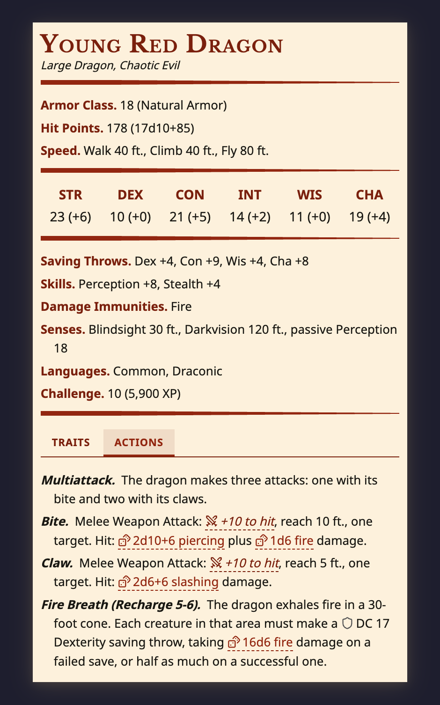
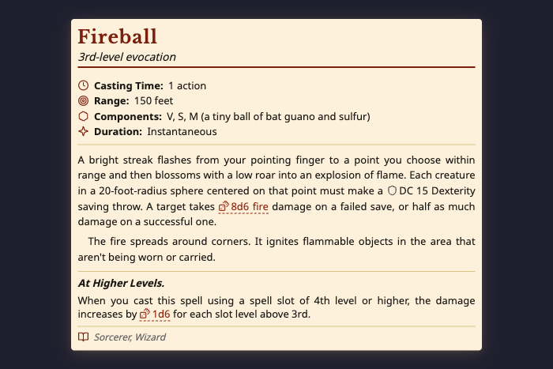
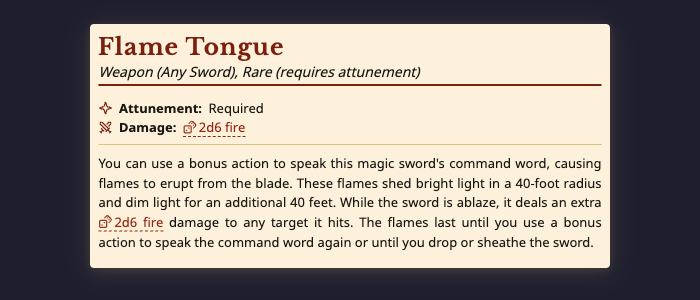

# Archivist - Obsidian Plugin

A D&D 5e/2024 toolkit for [Obsidian](https://obsidian.md) with a built-in AI agent powered by Claude. Write YAML code blocks to render parchment-styled stat blocks, or chat with the Archivist to generate entire monsters, spells, items, encounters, and NPCs on the fly.

## Screenshots

| Monster stat block | Spell block | Magic item |
| --- | --- | --- |
|  |  |  |

## Features

### AI Agent (Archivist Inquiry)
- **Generate content** -- Ask the Archivist to create monsters, spells, magic items, encounters, and NPCs. Generated content renders directly as styled stat blocks.
- **SRD lookup** -- Search and retrieve any entity from the bundled D&D 5e SRD (300+ monsters, spells, and items).
- **Vault-aware** -- Attach vault files and notes as context. The agent can read your campaign documents, session notes, and lore to inform its responses.
- **Inline editing** -- Select text in any note and ask the agent to rewrite, expand, or refine it in place.
- **Multi-tab conversations** -- Run multiple chat sessions in parallel with full history.
- **MCP server support** -- Extend the agent with custom Model Context Protocol servers.

### Content Blocks
- **Monster Stat Blocks** -- Full stat blocks with abilities, skills, saves, senses, and feature sections (traits, actions, reactions, legendary/lair/mythic actions). Single and two-column layouts.
- **Spell Blocks** -- Spell cards with level, school, casting time, range, components, duration, and description.
- **Magic Item Blocks** -- Item entries with rarity, attunement, type, and description.
- **Edit Mode** -- Click-to-edit UI for all block types with auto-calculated values (HP, AC, saves, skills, passive perception) and manual override support.

### Inline Tags
- Dice rolls: `` `dice:2d6+3` ``
- Attack rolls: `` `atk:DEX` ``
- Damage: `` `damage:1d8+STR` ``
- DC checks: `` `dc:WIS` ``

### D&D 5e Math Engine
Auto-calculates proficiency bonus, ability modifiers, saving throws, skill bonuses, HP, and AC from ability scores. Supports manual overrides with auto-recalculation.

### Entity Compendium
Bundled SRD with 300+ monsters, spells, and items. Supports custom user-created entities stored as vault notes with frontmatter. Reference entities inline with `{{monster:goblin}}` or `{{item:flame-tongue}}`.

## Usage

Create a fenced code block with the appropriate language tag:

### Monster

````markdown
```monster
name: Young Red Dragon
size: large
type: dragon
alignment: chaotic evil
ac: 18 (natural armor)
hp: 178 (17d10+85)
speed: 40 ft., climb 40 ft., fly 80 ft.
abilities: [23, 10, 21, 14, 11, 19]
```
````

### Spell

````markdown
```spell
name: Fireball
level: 3
school: Evocation
casting_time: 1 action
range: 150 feet
components: V, S, M (a tiny ball of bat guano and sulfur)
duration: Instantaneous
description:
  - A bright streak flashes from your pointing finger...
```
````

### Magic Item

````markdown
```item
name: Flame Tongue
type: Weapon (any sword)
rarity: rare
attunement: true
entries:
  - You can use a bonus action to speak this magic sword's command word...
```
````

Or use the slash commands: `/Monster Block`, `/Spell Block`, `/Item Block` to insert templates.

## Commands

Available via the command palette (`Cmd/Ctrl+P`):

| Command | Description |
| --- | --- |
| Archivist: Insert monster block | Insert a monster YAML template at the cursor |
| Archivist: Insert spell block | Insert a spell YAML template at the cursor |
| Archivist: Insert magic item block | Insert a magic item YAML template at the cursor |
| Archivist: Open chat view | Open the Archivist Inquiry chat panel |
| Archivist: Inline edit | Ask the agent to rewrite the current selection |
| Archivist: New tab | Open a new Inquiry chat tab |
| Archivist: New session (in current tab) | Start a fresh conversation in the active tab |
| Archivist: Close current tab | Close the active Inquiry chat tab |

## Requirements

- **Obsidian** 1.5.8 or newer, desktop only. The Archivist Inquiry agent shells out to Node.js APIs, so this plugin does not run on Obsidian mobile.
- **Anthropic API key** - required only to use the Archivist Inquiry AI agent. Stat blocks, inline dice tags, and the SRD compendium work without an API key. See [AI Setup](#ai-setup) below.

## Installation

**Community Plugins (coming soon):**
Search "Archivist" in Settings > Community Plugins > Browse.

**Beta via BRAT:**
1. Install [BRAT](https://github.com/TfTHacker/obsidian42-brat) from the Obsidian community plugins
2. Open BRAT settings and click "Add Beta Plugin"
3. Enter: `archivist-gg/archivist-obsidian-plugin`
4. Enable the plugin in Settings > Community Plugins

**Manual:**
Download `main.js`, `styles.css`, and `manifest.json` from the [latest release](https://github.com/archivist-gg/archivist-obsidian-plugin/releases), place them in `.obsidian/plugins/archivist-gg/`, and enable the plugin.

## AI Setup

The AI agent requires an Anthropic API key:

1. Get an API key from [console.anthropic.com](https://console.anthropic.com)
2. Open plugin settings > Archivist Inquiry
3. Enter your API key

## Building from Source

```bash
npm install
npm run build
```

Copy `main.js`, `styles.css`, and `manifest.json` to your vault's `.obsidian/plugins/archivist-gg/` directory.

## License

[AGPL-3.0](LICENSE)
