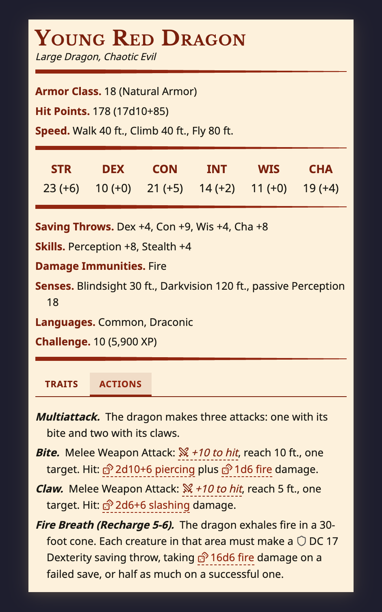
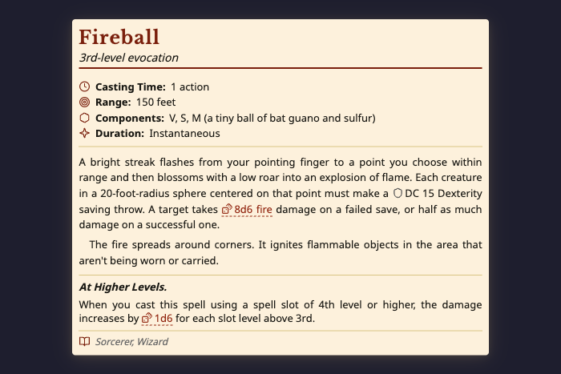
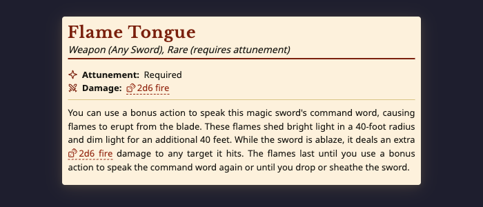

# Archivist - Obsidian Plugin

A D&D 5e/2024 toolkit for [Obsidian](https://obsidian.md). Write YAML code blocks to render parchment-styled stat blocks for monsters, spells, and magic items; drop inline dice tags into any note; browse a full SRD compendium; build your own homebrew compendiums; and manage player characters with a sheet and builder.

## Screenshots

| Monster stat block | Spell block | Magic item |
| --- | --- | --- |
|  |  |  |

## Features

### Content Blocks
- **Monster Stat Blocks** -- Full stat blocks with abilities, skills, saves, senses, and feature sections (traits, actions, reactions, legendary/lair/mythic actions). Single and two-column layouts.
- **Spell Blocks** -- Spell cards with level, school, casting time, range, components, duration, and description.
- **Magic Item Blocks** -- Item entries with rarity, attunement, type, and description.
- **Edit Mode** -- Click-to-edit UI for all block types with auto-calculated values (HP, AC, saves, skills, passive perception) and manual override support.

### Inline Tags
- Dice rolls: `` `dice:2d6+3` ``
- Attack rolls: `` `atk:DEX` ``
- Damage: `` `damage:1d8+STR` ``
- DC checks: `` `dc:WIS` ``

### D&D 5e Math Engine
Auto-calculates proficiency bonus, ability modifiers, saving throws, skill bonuses, HP, and AC from ability scores. Supports manual overrides with auto-recalculation.

### Entity Compendium
Bundled SRD with 300+ monsters, spells, and items. Supports custom user-created entities stored as vault notes with frontmatter. Reference entities inline with `{{monster:goblin}}` or `{{item:flame-tongue}}`.

## Usage

Create a fenced code block with the appropriate language tag:

### Monster

````markdown
```monster
name: Young Red Dragon
size: large
type: dragon
alignment: chaotic evil
ac: 18 (natural armor)
hp: 178 (17d10+85)
speed: 40 ft., climb 40 ft., fly 80 ft.
abilities: [23, 10, 21, 14, 11, 19]
```
````

### Spell

````markdown
```spell
name: Fireball
level: 3
school: Evocation
casting_time: 1 action
range: 150 feet
components: V, S, M (a tiny ball of bat guano and sulfur)
duration: Instantaneous
description:
  - A bright streak flashes from your pointing finger...
```
````

### Magic Item

````markdown
```item
name: Flame Tongue
type: Weapon (any sword)
rarity: rare
attunement: true
entries:
  - You can use a bonus action to speak this magic sword's command word...
```
````

Or use the slash commands: `/Monster Block`, `/Spell Block`, `/Item Block` to insert templates.

## Commands

Available via the command palette (`Cmd/Ctrl+P`):

| Command | Description |
| --- | --- |
| Archivist: Insert monster block | Insert a monster YAML template at the cursor |
| Archivist: Insert spell block | Insert a spell YAML template at the cursor |
| Archivist: Insert magic item block | Insert a magic item YAML template at the cursor |

## Requirements

- **Obsidian** 1.5.8 or newer, desktop only.

## Installation

**Community Plugins (coming soon):**
Search "Archivist" in Settings > Community Plugins > Browse.

**Beta via BRAT:**
1. Install [BRAT](https://github.com/TfTHacker/obsidian42-brat) from the Obsidian community plugins
2. Open BRAT settings and click "Add Beta Plugin"
3. Enter: `archivist-gg/archivist-obsidian-plugin`
4. Enable the plugin in Settings > Community Plugins

**Manual:**
Download `main.js`, `styles.css`, and `manifest.json` from the [latest release](https://github.com/archivist-gg/archivist-obsidian-plugin/releases), place them in `.obsidian/plugins/archivist-gg/`, and enable the plugin.

## Building from Source

```bash
npm install
npm run build
```

Copy `main.js`, `styles.css`, and `manifest.json` to your vault's `.obsidian/plugins/archivist-gg/` directory.

## Attribution

This plugin bundles a compendium built from the Dungeons & Dragons **System Reference
Document**, both the 5.1 (2014) and the 5.2 (2024) editions, published by **Wizards of the
Coast LLC** under the [Creative Commons Attribution 4.0 International
License](https://creativecommons.org/licenses/by/4.0/legalcode).

> This work includes material from the System Reference Document 5.1 ("SRD 5.1") by Wizards of
> the Coast LLC and available at
> <https://dnd.wizards.com/resources/systems-reference-document>, and from the System Reference
> Document 5.2 ("SRD 5.2") by Wizards of the Coast LLC and available at
> <https://www.dndbeyond.com/srd>. Both are licensed under the Creative Commons Attribution 4.0
> International License, available at
> <https://creativecommons.org/licenses/by/4.0/legalcode>. This material has been modified from
> its original form.

Copyright (C) Wizards of the Coast LLC. "Dungeons & Dragons" and "D&D" are trademarks of
Wizards of the Coast LLC. This project is unofficial and is neither affiliated with nor
endorsed by Wizards of the Coast.

The full notices, including what is bundled where and exactly what was changed, are in
[LICENSES/SRD-5.1.md](LICENSES/SRD-5.1.md) and [LICENSES/SRD-5.2.md](LICENSES/SRD-5.2.md).
The SRD text reaches this project through the [Open5e](https://open5e.com) v2 API, itself a
CC-BY-4.0 redistribution. Bundled icon assets are credited in [CREDITS.md](CREDITS.md).

## License

The plugin's own code is [AGPL-3.0](LICENSE). The bundled SRD compendium is CC-BY-4.0, not
AGPL, and carries the attribution above.
