# Archivist

[](https://github.com/archivist-gg/archivist-obsidian-plugin/releases/latest)
[](https://obsidian.md)
[](https://t.me/archivist_gg)

**Fifth edition character sheets for [Obsidian](https://obsidian.md) that do the math for you and roll with a click.** Build your character step by step, and the sheet works out every number from the rules: saves, skills, attacks, damage, spells, resources and rests. Give your character a portrait, fill a backpack, and watch an item's benefits switch on when you put it on. Around the sheet, monsters and spells you write in your notes appear as parchment stat blocks, dice in your notes roll with a click, and the System Reference Document 5.1 and 5.2 arrive as linked compendiums next to your own homebrew. Everything stays in your vault as ordinary notes you own.

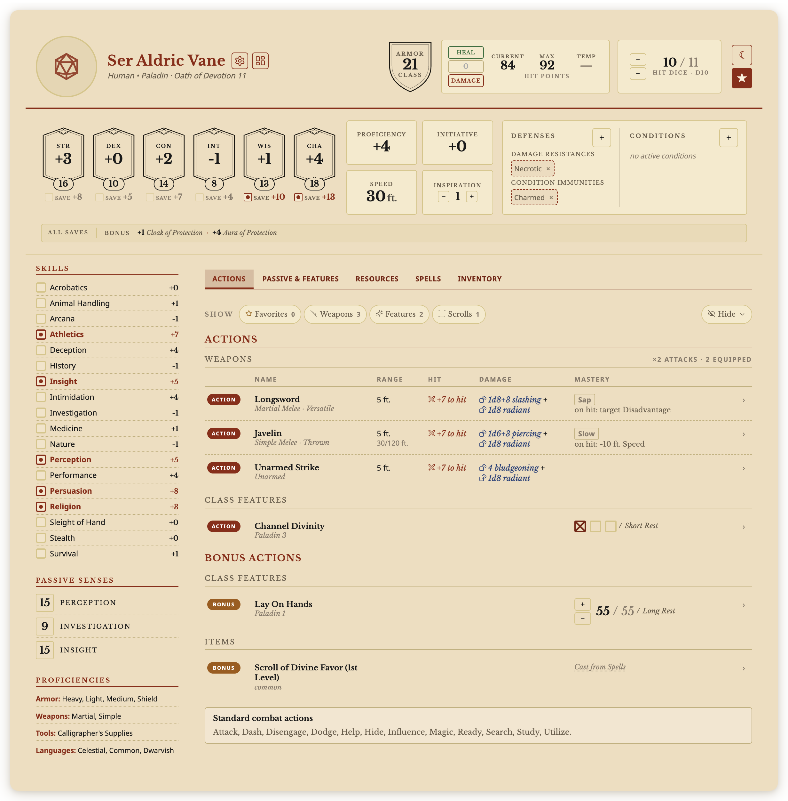

> **Which Archivist?** This is **Archivist by archivist-gg**, installed from this page. It is not related to other Obsidian plugins or apps named Archivist.

## Install

Archivist is not in Obsidian's community plugin list yet, so you install it with **BRAT**: a free helper plugin that installs plugins straight from their GitHub page and keeps them up to date.

### With BRAT (recommended)

1. In Obsidian, open **Settings → Community plugins**. Turn community plugins on if Obsidian asks, choose **Browse**, search for **BRAT** (Obsidian42 BRAT), then install and enable it.
2. Open **Settings → BRAT** and choose **Add beta plugin**.
3. Paste `archivist-gg/archivist-obsidian-plugin`, keep **Latest version** selected, and choose **Add plugin**.
4. Enable **Archivist** under **Settings → Community plugins** if BRAT has not already done it.

**One-click link.** Once BRAT is installed, paste this link into your browser's address bar and Obsidian opens BRAT with Archivist already filled in:

```
obsidian://brat?plugin=archivist-gg/archivist-obsidian-plugin
```

### Recommended: the Dice Roller plugin

Archivist rolls its dice with the free **Dice Roller** plugin (by Javalent). Install it from **Settings → Community plugins → Browse** and enable it. Without it, everything else works, and clicking a die shows a message instead of rolling.

### Requirements

| | |
| --- | --- |
| Obsidian | 1.7.2 or later, **desktop only** (Windows, macOS, Linux). Phones and tablets are not supported. |
| BRAT | The current BRAT needs Obsidian 1.11.4 or later. |
| Rolling | The Dice Roller plugin. |

### Installing by hand

Download the three files attached to the [latest release](https://github.com/archivist-gg/archivist-obsidian-plugin/releases/latest), put them in a new folder named `archivist-gg` inside your vault's `.obsidian/plugins` folder, restart Obsidian and enable Archivist. A copy installed by hand does not update itself.

### Updating

BRAT looks for new versions on its own. To update right away, open the command palette, type **BRAT** and run its command that checks all beta plugins for updates. If you chose a specific version in BRAT instead of **Latest version**, BRAT keeps you on that version.

### The first start

The first time Archivist starts (and after an update that changes the SRD), it adds the SRD to your vault: about 3,600 read-only notes in `Compendium/SRD 5e` (SRD 5.1) and `Compendium/SRD 2024` (SRD 5.2). That first start takes a little longer than the ones after it. SRD 5e starts hidden from the lists you pick from; turn it on in **Settings → Archivist → Compendiums**.

Then make a character with the **New character** command, the ribbon button, or **New character here** on any folder in the file explorer.

## Contents

- [Install](#install)
- [Features](#features)
  - [Character sheet](#character-sheet)
  - [Portrait](#portrait)
  - [Rolling dice](#rolling-dice)
  - [Actions, features and resources](#actions-features-and-resources)
  - [Spells](#spells)
  - [Inventory](#inventory)
  - [Builder](#builder)
  - [Compendiums](#compendiums)
  - [Stat blocks](#stat-blocks)
  - [Dice in your notes](#dice-in-your-notes)
  - [Compendium entries in your notes](#compendium-entries-in-your-notes)
  - [Settings](#settings)
  - [Commands](#commands)
- [FAQ](#faq)
- [Community](#community)
- [Licence and legal](#licence-and-legal)

## Features

At a glance:

- A **character sheet** that works out every number from the rules and your choices, and lets you change any of them yourself.
- A **portrait** for every character: pick a picture and choose the part that shows.
- **Click to roll** skills, saves, ability checks, Initiative, death saves, attacks and damage, with advantage, critical hits and a window for special rolls.
- A **Builder** for new characters and level ups, with every choice explained in its own words.
- **Spells**, **resources** and an **inventory** with bags, stacks, drag and drop, attunement and item icons.
- The **SRD 5.1 and SRD 5.2** as compendiums, plus **your own homebrew** next to them.
- **Stat blocks** for monsters, spells, items and more, written right in your notes.
- **Dice in your notes** that roll with a click, and any compendium entry pulled into a note by typing `{{`.
- Stat blocks and the sheet keep their parchment look **under any theme**, light or dark.

### Character sheet

Every character is an ordinary note in your vault. Open it and you get the sheet. Keep it in any folder, and link, search and back it up like any other note.

**Header**
- Your portrait, name, species, class and subclass with levels.
- **Armor Class**. Hover it to see how it is worked out: armor, shield, Dexterity, items and features, each with its amount.
- **Hit points** with Heal and Damage buttons, current, maximum and temporary hit points, and **death saves** at 0 HP.
- **Hit Dice** with + and −, and the **Short Rest** (a campfire) and **Long Rest** (a moon) buttons. A rest shows what it restores; on a Short Rest you spend Hit Dice and take the average or your own roll.
- **Manage & level up** opens the Builder; **Customize appearance** changes the sheet's layout, such as saves as their own section or as a strip, and the order of the tabs: drag them, or hide the ones you never use, for this character or with **Use these tabs for every character**.

**Abilities and saves**
- The six abilities with modifiers, scores and saving throws, Proficiency Bonus, **Initiative**, **Speed** and Inspiration.
- Hover an ability to see how its score adds up: the base score, then species, background, Ability Score Improvements, feats and items, each with its amount.
- Hover **Speed** to see every speed you have (walk, fly, swim, climb, burrow) and where each one comes from: species, feats, items, features, and conditions such as Restrained or Exhaustion.
- An **All saves** strip for what helps every save, such as the bonus from Aura of Protection or a reroll.
- **Defenses** (resistances, immunities, vulnerabilities, condition immunities) and **Conditions** as tags. A tag that comes from an item has a dashed border and names the item when you hover it; its × offers to take the item off. A condition that a feature you switch on gives you, such as Invisible from **Nature's Veil**, is dashed too and names the feature; its × switches the feature off.
- **Your own conditions.** The Conditions window lists conditions of your own next to the standard ones. **New condition** makes one: what it does on the sheet, such as a lower Speed or disadvantage on Dexterity saves, or plain words that always show. Right-click a standard condition to use your own words for it. A condition you add can carry a short note, such as how long it lasts, and so can a defense you add yourself.

**Skills, senses and proficiencies**
- Every skill with its bonus. The box in front of a skill sets your proficiency. Proficiency and expertise from the rules fill in on their own and say where they come from when you hover ("Expertise from Rogue"); you can also set half proficiency yourself.
- A skill or save you set differently from the rules shows `*`. Hover it to see both; click the `*` to go back to the rules.
- **ADV** and **DIS** tags show advantage and disadvantage that always apply, and where they come from (Cloak of Elvenkind on Stealth). Rerolls, such as a Halfling's Luck, show too.
- Passive Perception, Investigation and Insight, and your armor, weapon, tool and language proficiencies, all of which you can edit.

**Changing a number yourself**
- Right-click (or press and hold on a touch screen) Armor Class, Speed, an ability score or a passive sense and choose **Edit…**. A number you have set yourself offers **Go back to the rules**, with the rules' number beside it. Option+click (Alt+click) opens the edit box straight away.
- The sheet follows the rules for species, classes, subclasses, backgrounds, feats and items, and for what they give you: Weapon Mastery, Extra Attack, Aura of Protection, Rage on and off, a Warlock's pact weapon, armor too heavy for your Strength, resistances a feat lets you choose, and more.


### Portrait

Give every character a face. Click the round picture at the top left of the sheet (a d20 until you choose one):

- **Pick a picture** from your portraits folder, or tick **Show all vault images** to browse your whole vault. The search box finds a picture by name.
- **Import image** brings in a picture from your computer and keeps it in your portraits folder.
- **Frame it.** Drag the circle over the part you want and pull its corners to make it bigger or smaller, then choose **Use this framing**.
- The portrait shows on the sheet and in the Builder. Click it again to choose a different picture or frame it again, or choose **Remove current image** to go back to the d20.

The picture stays an ordinary image in your vault, and the character's note remembers which one you chose and how it is framed. The portraits folder is `PlayerCharacters/Portraits` unless you choose another in Settings.

<p align="center">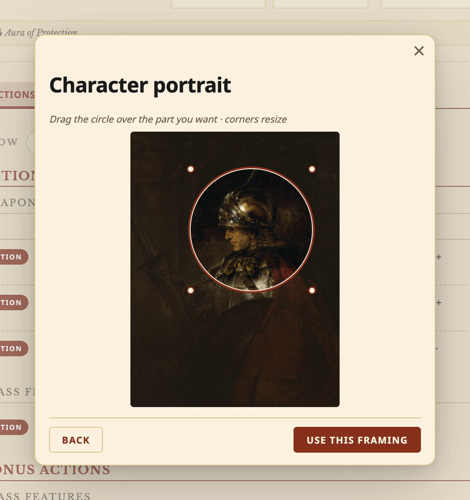</p>

### Rolling dice

Click a number on the sheet and it rolls. The result appears in the top right corner of the window. **Where roll results appear** in Settings moves it to another corner, or next to the number you clicked.

On a touch screen, press and hold anywhere on the sheet to open the menu a right-click opens, or to see what hovering shows.

Rolling your own dice at the table? Turn off **Roll dice when you click a number on the sheet** in Settings. A plain click on the sheet then rolls nothing, while Shift+click, Cmd+click (Ctrl+click) and the right-click menu still roll, and dice in your notes still roll with a click.

| On the sheet | Click | Shift+click | Cmd+click (Ctrl+click) | Option+click (Alt+click) | Right-click |
| --- | --- | --- | --- | --- | --- |
| Skill, save, ability modifier, Initiative | Roll d20 + bonus | Advantage | Disadvantage | Edit the number | Menu: the rolls, Edit, proficiency, Go back to the rules |
| Attack (HIT) | Roll to hit | Advantage | Disadvantage | **Roll attack…** window | Menu: the rolls, Roll attack…, saved rolls, Favorite, Hide |
| Damage | Roll all the damage | Critical hit | | **Roll damage…** window | Menu: damage, critical, each extra bonus, Roll damage…, saved rolls |

**Checks, saves and Initiative.** Roll a d20 plus your bonus. Advantage and disadvantage that always apply are used for you (advantage on Stealth rolls two d20s and keeps the higher; having both cancels them out), and the result says where the advantage came from.

**Death saves.** At 0 HP, click DEATH SAVES to roll one and fill in its circle: 10 or more is a success, a natural 1 counts as two failures, and a natural 20 brings you back with 1 HP.

**Attacks.** Click the HIT of a weapon, an Unarmed Strike or a feature's attack to roll to hit; a spell attack rolls the same way on the Spells tab. **Roll attack…** lets you choose normal, advantage or disadvantage and add something extra, such as `+1d4`. With **Extra Attack**, a weapon shows ×2 (or ×3) after its to-hit: hover it to see where the extra attacks come from, such as "Extra Attack, Paladin 5", and click it (or **Roll 2 attacks** at the top of the right-click menu) to roll every attack at once, one line each.

**Damage.** One click rolls the weapon's dice and modifier plus every bonus that applies on every hit, all at once. A bonus that only applies sometimes keeps its own line and its own roll. Shift+click rolls a critical hit by the rule you choose in the **Critical hits** setting: double the dice (the default), maximum dice plus a roll, or double the total. A hit with two or more damage types shows each type's subtotal.

**Roll damage…** lets you tick what this hit adds: a critical hit, both hands on a Versatile weapon, a bonus that only applies sometimes such as Sneak Attack, **Savage Attacker** (roll the weapon's dice twice and keep the higher) or **Great Weapon Fighting**, and a spell that adds damage to the attack, such as **Divine Smite** or **Searing Smite**, at the slot level you choose. It shows the whole roll before you make it, and it spends nothing: you cast the spell on the Spells tab.

**Saved rolls.** **Save as…** keeps what you ticked, for this weapon or for all your attacks, and the right-click menu lists it under Saved. A saved roll that no longer fits (say, for a weapon you no longer carry) is greyed out with the reason. **Manage saved rolls…** renames, reorders and deletes them.

**The result** shows what you rolled ("Stealth · Check · Advantage"), the total, every die (a die that was not kept is struck through, and a natural 20 or 1 stands out in colour), where your advantage came from, and each damage type's subtotal. In a corner of the window it shows every roll, from the sheet, a stat block or the dice in your notes, and your last three stay in one panel: the newest in full, the two before it as a line each, starting with its result. A line's × removes that line; the card's × or Esc closes them all. Next to the number, close it with its ×, a click anywhere else, Esc, or your next roll.

Anything you can roll gets a dotted underline when you hover it. Dice in your notes and in stat blocks roll the same way.

| | |
| --- | --- |
| 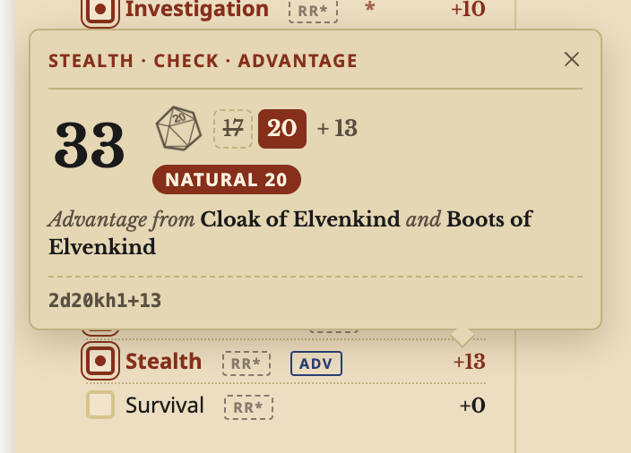 | 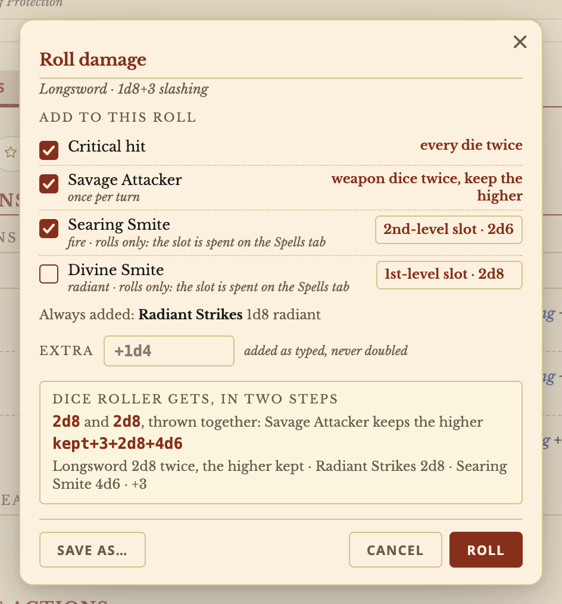 |

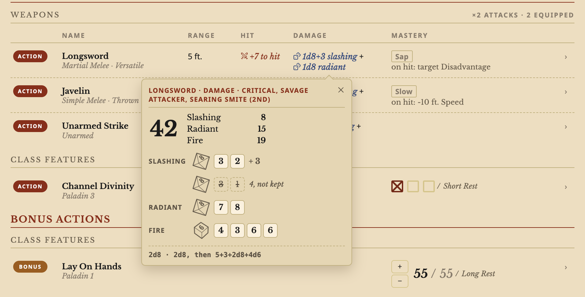

### Actions, features and resources

**Actions tab.** Everything you can do on your turn, grouped into Actions, Bonus Actions and Reactions:
- Your weapons with range, to hit, damage and **mastery** (Vex, Sap, Slow and the rest, with what each does on a hit), how many attacks each one makes (×2 after the to-hit with Extra Attack), which weapons are equipped, weapons a feature gives you, and the Unarmed Strike.
- **Natural weapons**, such as a species' claws, fangs or horns, get their own row next to the Unarmed Strike, with their own damage die and damage type. A trait you switch on adds its attack only while it is on.
- Damage bonuses such as Sneak Attack or Radiant Strikes sit right in the damage column, and a critical range wider than 20 shows under the weapon.
- Class features with their uses, items with charges, and consumables with a **Use** button.
- A feature you switch on, such as **Rage**, has an **Activate** button in front of its uses, which reads **Active** while it is on. How long it lasts shows under its name, and a rest ends it. A later feature can give it another way to pay: from Sorcerer 7, **Innate Sorcery** also offers **Spend 2 Sorcery Points**.
- Mark a row as a **Favorite** from its right-click menu to pin it to the top; the **Show** filters narrow the list and **Hide** tucks rows away.
- Click a row to open its full text and see how its numbers add up.

**Passive & Features tab.** Species, background, class and subclass features, feats, and passive or free actions, each with where it comes from and at what level. Features you switch on (Rage) or use have their button here.

**Resources tab.** Every limited resource, grouped by when it comes back (Short Rest or Long Rest): Hit Dice, use boxes, pools such as Lay On Hands, and dice that work like Hit Dice (the die, how many are left, − and +, and a box to type a number). Hover a die to see when it grows, such as "d6 at Bard 3, d8 at Bard 5". A feature that spends another resource lets you spend it right there.

**Option tabs.** Classes that choose from a list of options get their own tab, such as **Eldritch Invocations** or **Metamagic**: a table with filters, how many you know, prerequisites, and Activate or Spend buttons where an option has them. An option whose prerequisite you no longer meet stays listed so you can swap it out, and does nothing until you meet it.

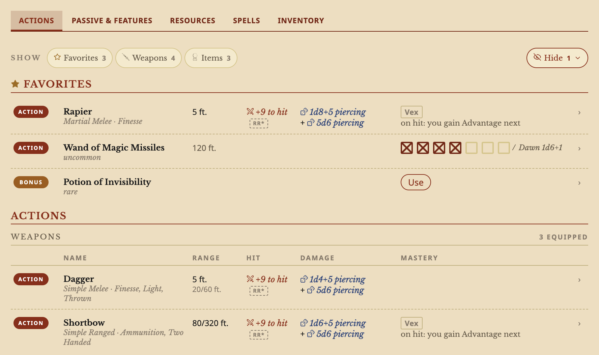

### Spells

- Your spell save DC and spell attack at the top, with **Cast** and **Manage** modes.
- A bonus to one class's spells changes only that class: while **Innate Sorcery** is on, your Sorcerer spell save DC goes up by 1 and your Sorcerer spell attacks roll with advantage, and your other classes' spells stay as they are.
- A feature that gives you an extra cantrip, such as the Druid's **Magician** or the Cleric's **Thaumaturge**, adds one to how many cantrips you can have.
- Spells grouped by level: cantrips, leveled spells with their **slot boxes**, a Warlock's **Pact Magic** slots, spells you can cast for free or at will from a species, feat or invocation, and always-prepared spells marked as such.
- Columns for casting time, range, **Hit / DC**, effect (damage dice with a damage type icon, healing, targets) and components with duration, plus concentration and ritual marks.
- **CAST** spends a slot. A spell attack's Atk rolls to hit, with its **ADV** or **DIS** on a line under the number, as on a weapon.
- **Free casts.** A spell you can cast once per Long Rest without a slot, such as a species' spells or the level 1 spell from **Magic Initiate**, has an outlined **CAST** that counts the cast and greys out once it is used; a rest gives it back.
- A cantrip that needs concentration, such as **Guidance**, has a **CAST** button in place of At Will, and casting it starts your concentration.
- A choice that picks a list of spells, such as a **Circle of the Land** Druid's land, prepares that list's spells, and **Natural Recovery** casts one of them without a slot.
- The Spells tab tells you when each class can change its prepared spells: after a Long Rest or when you gain a level, how many, and from where (a Wizard's spellbook).
- **Items that hold spells** (a wand or staff with charges) get their own section with the item's charges. CAST spends those charges and uses the item's own save DC and attack bonus, and works only while the item is equipped (and attuned, if it needs attunement). Spell scrolls work too.

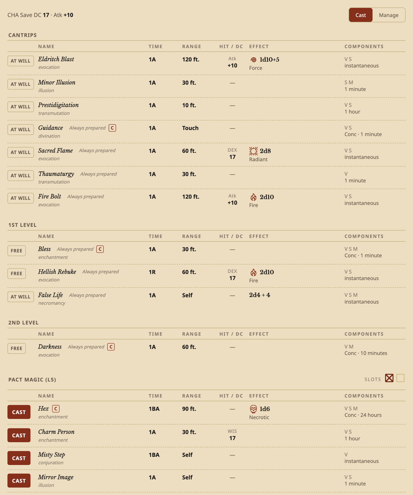

### Inventory

- Three **attunement** slots with your attuned items' icons, and a **Coins** card with every coin (PP, GP, EP, SP, CP) and your total in gold. Click the card to add or subtract coins.
- **Search**, filters for equipped, attuned or carried items, type and rarity, and **Add item** from any compendium you can see. The list stays open while you add several items, each with − and + to add more than one at a time, and shows what you have added.
- Sections for Favorites, **On you**, and each **container** (a Backpack, a Quiver, a Bag of Holding whose contents weigh nothing), with the total weight you carry.
- **Stacks.** Click a stack's ×N to change how many you have (−, +, or type a number; it also shows what one weighs and costs). Anything you add, move or unequip joins a matching stack; **Split one off** separates one, and equipping a stack of weapons takes one from it.
- **Drag and drop.** Drag a row into a container, out of it, or onto **On you**. Drop it on a matching item to add it to that stack. An item that is equipped or attuned, has its own note, charges or changes, or is a container keeps its own row.
- Each row's menu: Equip or Unequip, **Move to** another container, **Trade with…** another character, Quantity, Split one off, Edit note, Remove.
- **Select** picks several rows at once to trade, move or remove them together.
- **Trade** items and coins with another character in your vault. The Trade window shows both inventories side by side: move items either way (part of a stack, a container with what is in it; worn or attuned items come off), add coins, then **Trade**. **Undo** puts both characters back, and each Inventory keeps a **Given and received** list.
- **Benefits follow what you wear.** An item's resistances, immunities, AC, saves, senses, speeds and effects count while it is equipped (and attuned, if it needs attunement). A magic weapon that needs attunement attacks as a plain weapon until you attune it.
- Item **notes**, **charges** with when they come back ("Dawn 1d6+1"), and a **Customize** card for changes to one item.
- **Icons** for weapons, armor, gear, potions, wands, rings and more.

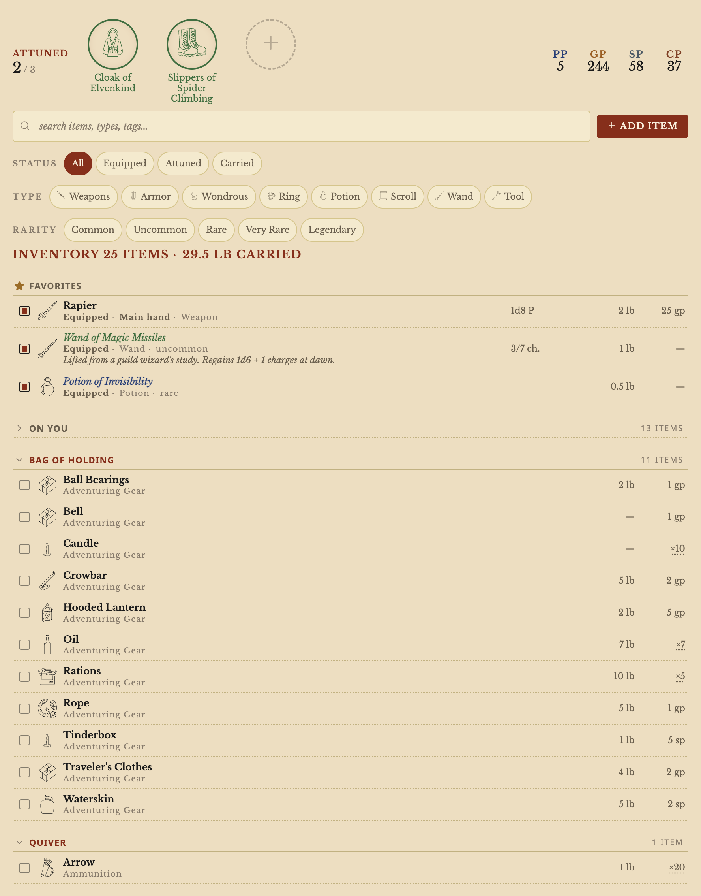

### Builder

Make a character with **New character** (the command or the ribbon button) or **New character here** on any folder, and the Builder opens. Come back later with **Manage & level up** to level up or change a choice.

- Six steps: **Race / Species**, **Class & Levels**, **Background**, **Abilities**, **Equipment** and **Details**.
- Every pick is a list of what is in your compendiums, SRD and homebrew together, with where each one comes from. Select one to read its full card before you decide.
- **What you decide** lists every choice your pick asks for (skills, a lineage, a Fighting Style, Weapon Mastery, a subclass, feats or Ability Score Improvements) with its level, and marks what is still open.
- **Features by level** shows the whole class progression: features you have are filled in, the ones ahead are hollow.
- Multiclass with **Add another class**, set ability scores by standard array, point buy, typing them in or rolling, and take your starting equipment from your class and background.
- **An older species with a 2024 background.** When your background gives ability increases, a species written for the 2014 rules adds none of its own, as the 2024 rules say. The Abilities step explains it, and its **Keep species ability increases** switch keeps both if your table allows it.
- **The same skill or tool twice.** When your species and your background give you the same skill or tool, the Builder lets you take a different one in its place.
- The SRD 5.1 subraces (Hill Dwarf, High Elf, Lightfoot Halfling, Rock Gnome) get their parent species' ability increases, speed, senses, languages and traits.

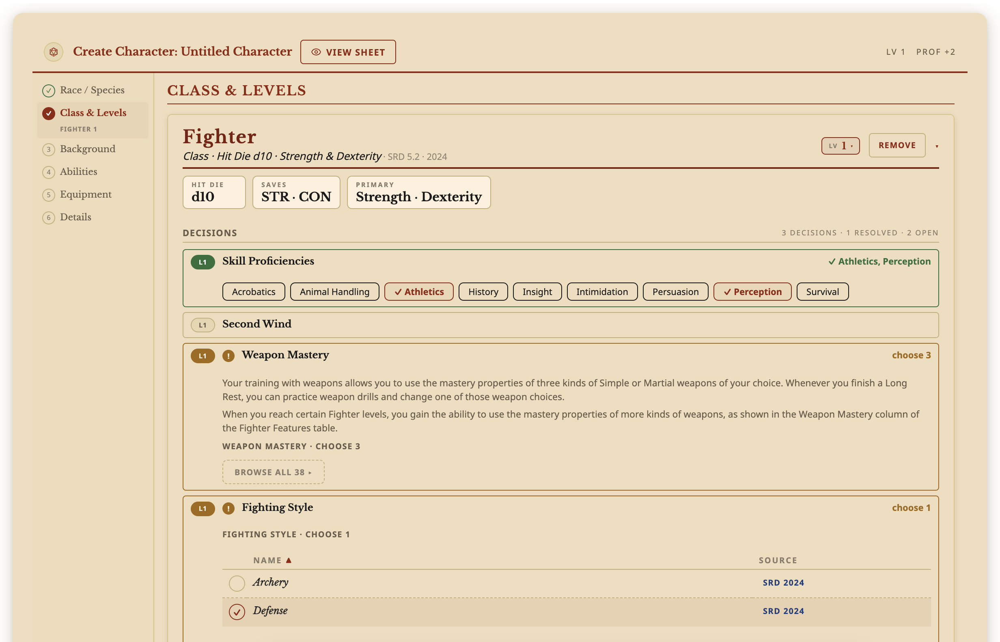

### Compendiums

A compendium is a folder of notes inside your `Compendium` folder, one note for each monster, spell, item and so on.

- **SRD 5.1 and SRD 5.2 included.** Archivist adds both as read-only compendiums (`SRD 5e` and `SRD 2024`): every SRD spell, monster, magic item, class, subclass, species, background, feat and condition. An update only touches the notes that changed. SRD 5e starts hidden from the lists you pick from.
- **Your own homebrew.** Keep your own monsters, spells, items and more in your own compendiums, next to the SRD. Save any stat block to a compendium with the button beside it; if you do not have one yet, Archivist offers to make one.
- **Name them your way.** Give SRD 5e and SRD 2024 any name in **Settings → Archivist → Compendiums**, and Archivist shows it wherever it names them. Your folders, notes and links keep their names.
- **Show or hide, lock or unlock.** Each compendium has a **Visible** switch (whether its entries show up in the sheet's and the Builder's lists and when you type `{{`) and a **Read-only** switch. "Save as new" copies an entry from a read-only compendium into one you can edit.
- **Changes show up right away.** Edit, add, rename or delete a compendium note and Archivist uses it at once, with no restart. An open sheet shows the change the next time it updates.
- **Quick to start.** Archivist remembers your compendiums on each device, so later starts only read the notes that changed.

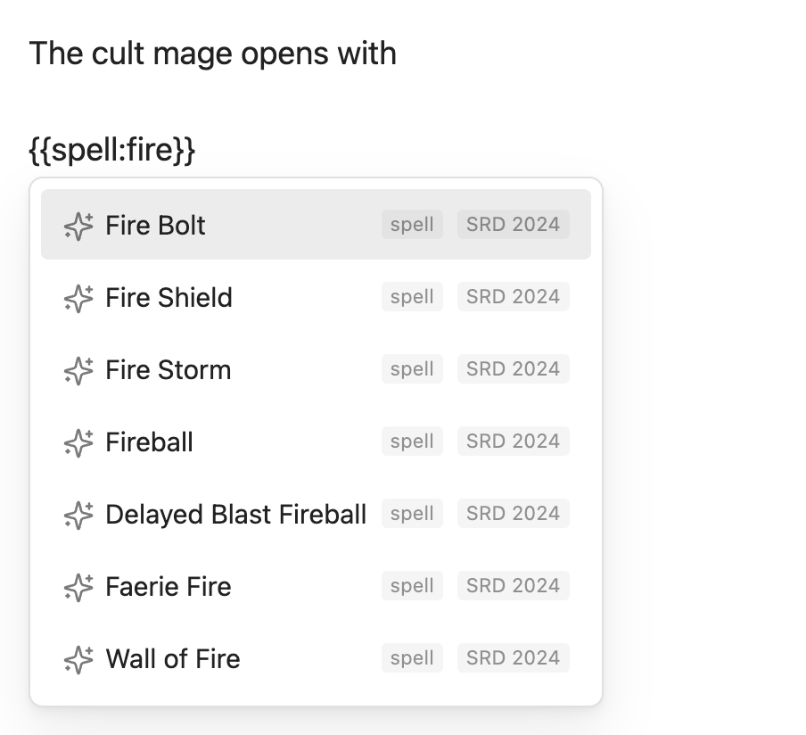

### Stat blocks

Write a monster, spell or item in any note and it appears as a parchment stat block. A monster looks like this:

````markdown
```monster
name: Young Red Dragon
size: large
type: dragon
alignment: chaotic evil
ac:
  - ac: 18
    from: [natural armor]
hp:
  average: 178
  formula: 17d10 + 85
speed: { walk: 40, fly: 80, climb: 40 }
abilities: { str: 23, dex: 10, con: 21, int: 14, wis: 11, cha: 19 }
cr: '10'
actions:
  - name: Rend
    entries:
      - 'Melee Attack Roll: `atk:STR+PB`, reach 10 ft. `dmg:2d6+STR` Slashing damage plus `dmg:1d6` Fire damage.'
```
````

- **Twelve kinds of stat block:** monsters, spells, magic items, armor, weapons, classes, subclasses, species, backgrounds, feats, class options and conditions.
- **The math is done for you.** Ability modifiers, Proficiency Bonus and XP come from the scores and challenge rating, and the edit form works out saves, skills, passive Perception and hit points, which you can change. Write `atk:STR+PB` or `dc:WIS` in an action and the block fills in the number from the creature's own scores.
- **Buttons beside each block:** **save to compendium**, delete, **edit** in a form (for monsters, spells, items and conditions, with suggestions as you type), and a **two-column** layout for monsters.
- A creature a spell summons, such as the **Otherworldly Steed** of Find Steed, shows the numbers that grow with the spell in words: "AC 10 + the spell's level".
- The **Insert monster block**, **Insert spell block** and **Insert magic item block** commands start you off with a ready-made outline.

<p align="center">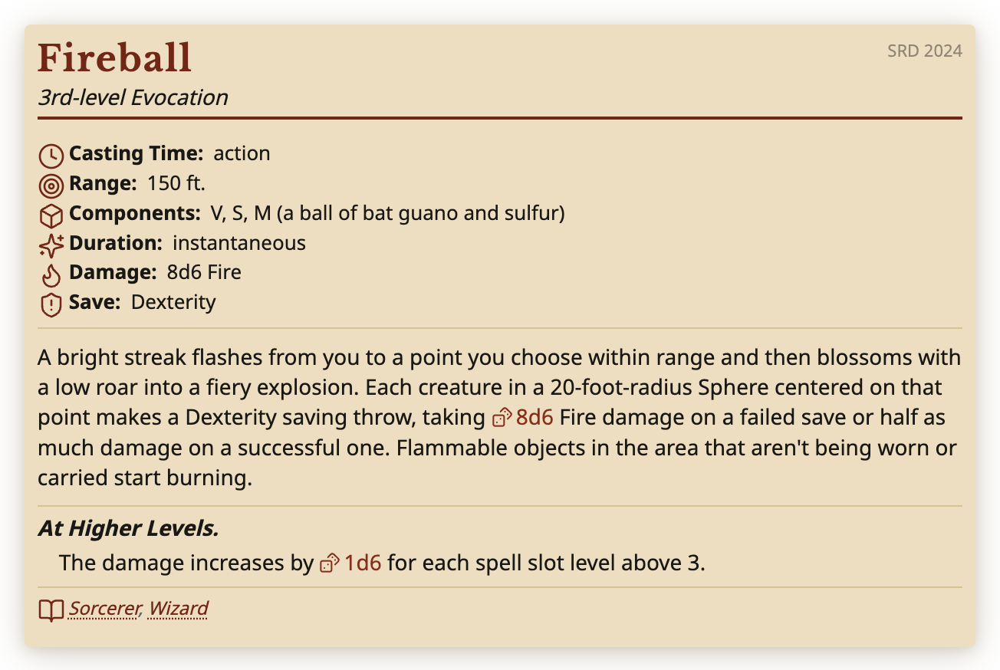</p>

### Dice in your notes

Put a roll between backticks anywhere in a note, like `` `dice:2d6` ``, and it turns into a button that rolls 2d6 when you click it. `dmg:` for damage, `atk:` for an attack bonus and `dc:` for a save DC (shown, not rolled) work the same way.

### Compendium entries in your notes

Type `{{` and start typing a name to pull any entry from your compendiums into a note: a spell, monster, item, species, subclass, class option such as an Eldritch Invocation, and more. Pick it from the list, and on a line of its own it shows as the full stat block, both while you write and when you read.

- Every block names where it comes from in its top right corner, such as SRD 2024 or your own compendium. If the name no longer matches anything, it says so.
- **Save to compendium** on a stat block in a note files it in a compendium, and the note keeps showing the same block, now read from there.

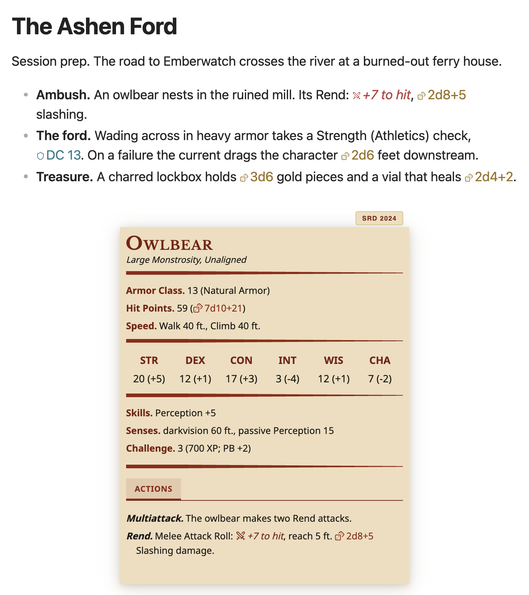

### Settings

**Settings → Archivist:**

| Setting | What it does |
| --- | --- |
| Compendium root folder | The folder that holds your compendiums (`Compendium` unless you change it). |
| Player characters folder | Where **New character** puts new characters. A character works in any folder. |
| Portraits folder | Where the portrait picker looks for pictures and keeps the ones you import (`PlayerCharacters/Portraits` unless you change it). |
| Rolls → Critical hits | What a critical hit does to damage: double the dice (the default), maximum dice plus a roll, or double the total. |
| Rolls → Where roll results appear | Top right (the default), bottom right, top left or bottom left of the window, for every roll: the sheet's, a stat block's and the dice in your notes. **Next to the number** opens a sheet roll's result beside the number you clicked. |
| Rolls → Roll dice when you click a number on the sheet | On unless you turn it off. Off, a plain click on a to-hit, damage, save, skill, check or Initiative number rolls nothing; Shift+click and the right-click menu still roll. |
| Compendiums | **SRD 5.1 name** and **SRD 5.2 name** to rename the two SRD compendiums, then one row per compendium, with how many entries it holds and its **Visible** and **Read-only** switches. |

### Commands

| Command | What it does |
| --- | --- |
| New character | Makes a new character and opens the Builder. Also on the ribbon, and as **New character here** on any folder. |
| Insert monster block | Adds a monster outline where your cursor is. |
| Insert spell block | Adds a spell outline. |
| Insert magic item block | Adds a magic item outline. |
| Rebuild compendium cache | Reads every compendium note again. Use it if a compendium ever looks out of date. |

## FAQ

### Is it free?

Yes. Archivist is free to download and use, under the freeware licence in [LICENSE](LICENSE).

### Is it open source?

No. From 0.10.0 on, Archivist is free to use but its source code is not published; this page holds the downloads, the licence and the notices. Versions up to 0.9.0 were released under AGPL-3.0 and stay under it.

### Why isn't it in the Community plugins list?

It is not listed there yet. Until it is, BRAT installs it from this page and keeps it up to date.

### Does it work on mobile?

No. Archivist is desktop only.

### What content does it include?

The System Reference Document 5.1 and 5.2, released by Wizards of the Coast under CC-BY-4.0, and nothing else. Your own homebrew goes in your own compendiums.

### Do I need other plugins?

Rolling uses the Dice Roller plugin. Stat blocks, the compendiums and the character sheet work without it.

### Does it work with my theme?

Yes. Stat blocks, the character sheet and the Builder keep their parchment look under any theme.

### Is this the Archivist I saw elsewhere?

Only if it installs from `archivist-gg/archivist-obsidian-plugin`. Other plugins and apps named Archivist are unrelated.

### Was AI used to build it?

Yes. Archivist is built with help from an AI coding assistant.

### Where are my characters and notes stored?

In your vault, as ordinary notes you can open, search and back up. Portraits are ordinary pictures in your vault too.

### Where do I report a bug?

In [Issues](https://github.com/archivist-gg/archivist-obsidian-plugin/issues). Tell us your Obsidian and Archivist versions, and if something looks wrong, add a screenshot or the text of the note.

## Community

- **Telegram:** [t.me/archivist_gg](https://t.me/archivist_gg) (@archivist_gg) for release news.
- **GitHub Issues:** [bugs and ideas](https://github.com/archivist-gg/archivist-obsidian-plugin/issues).

## Licence and legal

**Licence.** Archivist is freeware: free to download and use, with no modifying, reselling or redistributing. See [LICENSE](LICENSE). Versions up to 0.9.0 were released under the GNU Affero General Public License, version 3 (AGPL-3.0), and stay under it.

**Compatibility and SRD content.** Archivist is a free, unofficial Obsidian plugin, compatible with fifth edition. It includes rules content from SRD 5.1 and SRD 5.2 under CC-BY-4.0. Not affiliated with Wizards of the Coast.

The verbatim SRD 5.1 and SRD 5.2 attribution, and how the material was changed, are in [THIRD-PARTY-NOTICES.md](THIRD-PARTY-NOTICES.md).

**Credits.**
- **Icons:** the item, condition and spell effect icons are line icons by Noun Project creators, under [CC BY 3.0](https://creativecommons.org/licenses/by/3.0/). Every icon and creator is listed in [CREDITS.md](CREDITS.md).
- **Fonts:** Libre Baskerville and Noto Sans, under the SIL Open Font License 1.1.
- **Libraries:** js-yaml and zod (MIT), monkey-around (ISC).
- **Portrait in the screenshots:** *Man in Armour* by Rembrandt (1655), Kelvingrove Art Gallery and Museum, Glasgow. Public domain, from [Wikimedia Commons](https://commons.wikimedia.org/wiki/File:Rembrandt_Man_in_Armour.jpg).

Every third-party notice is in [THIRD-PARTY-NOTICES.md](THIRD-PARTY-NOTICES.md).
