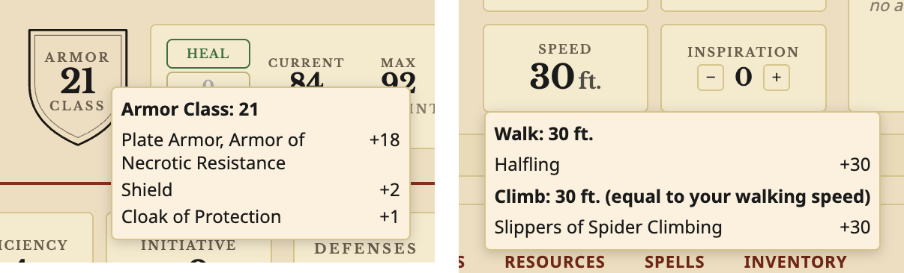

# Archivist

[](https://github.com/archivist-gg/archivist-obsidian-plugin/releases/latest)
[](https://obsidian.md)
[](https://t.me/archivist_gg)

**Fifth edition character sheets for [Obsidian](https://obsidian.md) that do the math and roll on click.** A step-by-step Builder makes the character; the sheet then works out every number from the rules: saves, skills, attacks, damage, spells, resources and rests, with an inventory that holds containers, stacks and attuned items whose benefits switch on when you wear them. Around the sheet, Archivist draws parchment stat blocks from YAML in any note, turns dice in your notes into click-to-roll tags, and installs the System Reference Document 5.1 and 5.2 into your vault as linked compendiums, next to your own homebrew. Everything is stored as plain Markdown notes you own.


> **Which Archivist?** This is **Archivist by archivist-gg** (plugin id `archivist-gg`), installed from this repository. It is not related to the other Obsidian plugins or apps named Archivist.

## Install

Archivist installs through **BRAT** (Obsidian42 BRAT), a community plugin that installs and updates plugins straight from their GitHub releases.

### With BRAT (recommended)

1. In Obsidian, open **Settings → Community plugins**. Turn community plugins on if Obsidian asks, choose **Browse**, search for **BRAT** (Obsidian42 BRAT), then install and enable it.
2. Open **Settings → BRAT** and choose **Add beta plugin**.
3. Paste `archivist-gg/archivist-obsidian-plugin`, keep **Latest version** selected, and choose **Add plugin**.
4. Enable **Archivist** under **Settings → Community plugins** if BRAT has not already done it.

**One-click link.** With BRAT installed, paste this link into your browser's address bar and Obsidian opens BRAT's dialog with the repository filled in:

```
obsidian://brat?plugin=archivist-gg/archivist-obsidian-plugin
```

### Recommended: the Dice Roller plugin

Every roll in Archivist goes through the **Dice Roller** community plugin (by Javalent). Install it from **Settings → Community plugins → Browse** and enable it. Without it, stat blocks, the compendiums and the character sheet all work; clicking a die shows a notice instead of rolling.

### Requirements

| | |
| --- | --- |
| Obsidian | 1.7.2 or later, **desktop only** (Windows, macOS, Linux). Phones and tablets are not supported. |
| BRAT | BRAT 2.2.0 itself needs Obsidian 1.11.4 or later. |
| Rolling | The Dice Roller plugin. |

### Manual install

Download `main.js`, `manifest.json` and `styles.css` from the [latest release](https://github.com/archivist-gg/archivist-obsidian-plugin/releases/latest), put them in a folder named `archivist-gg` inside your vault's `.obsidian/plugins` folder, restart Obsidian and enable Archivist. A manual install does not update itself.

### Updating

BRAT checks this repository for new releases. To update at once, open the command palette, type **BRAT** and run its command that checks all beta plugins for updates and updates them. If you picked a release tag instead of **Latest version** in BRAT's dialog, BRAT keeps you on that version.

### The first start

On its first start (and after each update that changes the SRD), Archivist writes the SRD into your vault: about 3,600 read-only notes in `Compendium/SRD 5e` (SRD 5.1) and `Compendium/SRD 2024` (SRD 5.2). The first start also builds a compendium cache on your device, so it is slower than the starts after it. The SRD 5e compendium starts hidden from the pickers; turn it on in **Settings → Archivist → Compendiums**.

Then create a character with the **New character** command, the ribbon button, or **New character here** on any folder in the file explorer.

## Contents

- [Install](#install)
- [Features](#features)
  - [Character sheet](#character-sheet)
  - [Rolling dice](#rolling-dice)
  - [Actions, features and resources](#actions-features-and-resources)
  - [Spells](#spells)
  - [Inventory](#inventory)
  - [Builder](#builder)
  - [Compendiums](#compendiums)
  - [Stat blocks](#stat-blocks)
  - [Inline dice tags](#inline-dice-tags)
  - [References and embeds](#references-and-embeds)
  - [Settings](#settings)
  - [Commands](#commands)
  - [Theme compatibility](#theme-compatibility)
- [FAQ](#faq)
- [Community](#community)
- [Licence and legal](#licence-and-legal)

## Features

At a glance:

- A **character sheet** that derives every number from the rules and your choices, and lets you set any of them by hand.
- **Click to roll** skills, saves, ability checks, Initiative, death saves, attacks and damage, with advantage, critical hits and a dialog for everything else.
- A **Builder** for new characters and level ups, with every choice explained by its own text.
- **Spells**, **resources** and an **inventory** with containers, stacks, attunement and item icons.
- The **SRD 5.1 and SRD 5.2** as compendiums of notes, plus **homebrew compendiums** in the same format.
- **Stat blocks** for monsters, spells, items and ten other entity types, written as YAML in any note.
- **Inline dice tags** and **`{{type:slug}}` references** that embed a compendium entry anywhere.
- Blocks and the sheet keep their own parchment look **under any theme**.

### Character sheet

A character is a note with a `pc` YAML code block. Open it and Archivist shows the sheet; the data stays in the note, so you can read, search, link and back it up like any other note. A note with `archivist-type: pc` in its frontmatter opens as the sheet in any folder.

**Header**
- Portrait (pick an image from your vault or import one), name, species, class and subclass with levels.
- **Armor Class** shield. Hover it for the breakdown: armor, shield, Dexterity, items and features, each with its amount.
- **Hit points** with Heal and Damage, current, maximum and temporary HP, and **death saves** at 0 HP.
- **Hit Dice** with + and −, and the **Short Rest** and **Long Rest** buttons. A rest opens a dialog that lists what it restores; a Short Rest lets you spend Hit Dice and apply the average or your own number.
- **Manage & level up** opens the Builder; **Customize appearance** changes the sheet's layout, such as saves drawn as their own section or as a strip.

**Abilities and saves**
- The six abilities with modifiers, scores and saving throws, Proficiency Bonus, **Initiative**, **Speed** and Inspiration.
- Hover **SPEED** for every speed you have (walk, fly, swim, climb, burrow) and where each comes from: species, feats, items, features, a minimum an item sets, and conditions such as Restrained or Exhaustion.
- An **All saves** strip for what applies to every save, such as Aura of Protection's bonus or a reroll.
- **Defenses** (resistances, immunities, vulnerabilities, condition immunities) and **Conditions**, as chips. A chip an item grants is dashed and names the item on hover; its × offers to unequip the item.

**Skills, senses and proficiencies**
- Every skill with its bonus. The box in front of a skill sets its proficiency; the rules' own levels (proficient, expertise) are filled in and name their source on hover ("Expertise from Rogue"), and half proficiency can be set by hand.
- A skill or save you set by hand where the rules give another level shows `*`; its hover names both, and a click on the `*` asks, then goes back to the rules.
- **ADV** and **DIS** tags show advantage and disadvantage that always apply, with their sources on hover (Cloak of Elvenkind on Stealth). Rerolls such as a Halfling's Luck show too.
- Passive Perception, Investigation and Insight, and armor, weapon, tool and language proficiencies, each editable.

**Editing by hand**
- Right-click (or long-press) AC, Speed, an ability score or a passive sense for **Edit…**, and **Go back to the rules** on a value you set yourself, with the rules' value beside it. Option+click (Alt+click) opens the edit box at once.
- The sheet follows the rules for species, classes, subclasses, backgrounds, feats and items, and for what they grant: Weapon Mastery, Extra Attack, Aura of Protection, Rage switched on and off, armor too heavy for your Strength, resistances a feat lets you pick, and more.



### Rolling dice

Click a number on the sheet and it rolls through Dice Roller. The result opens in a popover beside the cell you clicked.

| On the sheet | Click | Shift+click | Cmd+click (Ctrl+click) | Option+click (Alt+click) | Right-click |
| --- | --- | --- | --- | --- | --- |
| Skill, save, ability modifier, Initiative | Roll d20 + bonus | Advantage | Disadvantage | Edit the value | Menu: the rolls, Edit, proficiency levels, Go back to the rules |
| Attack (HIT) | Roll to hit | Advantage | Disadvantage | **Roll attack…** dialog | Menu: the rolls, Roll attack…, saved rolls, Favorite, Hide |
| Damage | Roll the whole damage line | Critical hit | | **Roll damage…** dialog | Menu: damage, critical, each conditional bonus, Roll damage…, saved rolls |

**Checks, saves and Initiative.** Skills, saving throws, ability checks and Initiative roll a d20 plus the bonus. Advantage and disadvantage that always apply are used automatically (an Advantage on Stealth rolls 2d20 and keeps the higher; both at once cancel). The popover names where an advantage came from.

**Death saves.** At 0 HP, a click on DEATH SAVES rolls one and fills its dot: 10 or more is a success, a natural 1 counts as two failures, and a natural 20 brings you back with 1 HP.

**Attacks.** The HIT cell of a weapon, an Unarmed Strike or a feature's weapon rolls to hit, and a spell attack's Atk on the Spells tab rolls the same way. **Roll attack…** picks normal, advantage or disadvantage and adds an Extra formula such as `+1d4`.

**Damage.** A click rolls the weapon's dice and modifier plus every bonus that applies on every hit, in one throw; a bonus with a condition keeps its own line and its own roll. Shift+click rolls a critical hit, by the rule you choose in the **Critical hits** setting: double the dice (the default), maximum dice plus a roll, or double the total. A roll with two or more damage types names each subtotal.

**Roll damage…** lets you tick what this hit adds: a critical hit, the two-handed grip of a Versatile weapon, a bonus with a condition such as Sneak Attack, an option such as **Savage Attacker** (the weapon's dice rolled twice, the higher kept) or **Great Weapon Fighting**, and a spell that adds damage to the attack, such as **Divine Smite** or **Searing Smite**, at the slot level you pick. The dialog shows the exact notation Dice Roller gets. It spends nothing: you cast the spell on the Spells tab.

**Saved rolls.** **Save as…** in either dialog stores what you ticked, for this weapon or for every attack, and the right-click menu lists it under Saved. A saved roll that no longer applies (a weapon you no longer carry) is greyed out with the reason. **Manage saved rolls…** renames and deletes them.

**The result popover** shows the title and options ("Stealth · Check · Advantage"), the total, every die with a dropped die struck through, a natural 20 or 1 in colour, the advantage source, each damage type's subtotal and the notation. It closes with its ×, a click outside, Esc or the next roll.

Everything that rolls shows a dotted underline on hover. The dice in your notes and stat blocks roll through Dice Roller too.

| | |
| --- | --- |
|  |  |


### Actions, features and resources

**Actions tab.** Everything you can do on your turn, grouped by Action, Bonus Action and Reaction:
- A weapons table with range, to hit, damage and **mastery** (Vex, Sap, Slow and the rest, with what they do on a hit), the number of attacks you make, your equipped weapons, weapons a feature grants and the Unarmed Strike.
- Damage bonuses sit in the DAMAGE cell, such as Sneak Attack or Radiant Strikes; a critical range other than 20 shows under the row.
- Class features with their uses, items with charges, and consumables with a **Use** button.
- Mark a row as a **Favorite** from its right-click menu and it pins to the top of the tab; the **Show** chips filter the rows and **Hide** tucks rows away.
- Click a row to expand its full text and a breakdown of its numbers.

**Passive & Features tab.** Species, background, class and subclass features, feats and passive or free actions, each with its source and level. Features that switch on (Rage) or that you activate show their button.

**Resources tab.** Every limited resource, grouped by when it comes back (Short Rest, Long Rest): Hit Dice, use boxes, pools such as Lay On Hands, and **die resources** that draw like Hit Dice (the die, what is left, − and +, and a typed number). Hover a die for its next step, such as "d6 at Bard 3, d8 at Bard 5". A feature that spends another resource opens a spend popover with that resource's own control.

**Option tabs.** Classes with a pool of options get their own tab, such as **Eldritch Invocations** or **Metamagic**: a table with filters, how many you know, prerequisites, and Activate or Spend buttons where an option has them. An option whose prerequisite is not met stays listed so you can unlearn it, and does nothing.


### Spells

- A header with your spell save DC and spell attack, and **Cast** and **Manage** modes.
- Spells grouped by level: cantrips at will, leveled spells with their **slot boxes**, a Warlock's **Pact Magic** with its slots, spells you can cast for free or at will from a species, feat or invocation, and always-prepared spells marked as such.
- Columns for casting time, range, **Hit / DC**, effect (damage dice with a damage type icon, healing, targets) and components with duration; concentration and ritual marks.
- **CAST** spends a slot. A spell attack's Atk rolls to hit.
- **Items that store a spell** (a wand or staff with charges) get their own section headed by the item and its charges. CAST spends the item's charges, uses the item's own save DC and attack bonus, and works only while the item is equipped, and attuned when it needs attunement. Spell scrolls work too.


### Inventory

- **Attunement** slots (three) with the attuned items' icons, and your **coins** (PP, GP, SP, CP).
- **Search** and filters by status (equipped, attuned, carried), type and rarity, and **Add item** from any visible compendium.
- Sections for Favorites, **On you**, and one for each **container** (a Backpack, a Quiver, a Bag of Holding whose contents weigh nothing), with the total weight you carry.
- **Stacks and quantity.** A stack's ×N opens a counter (−, +, a typed number, what one weighs and costs). What you add, move or unequip joins the stack you already have; **Split one off** separates one; Equip on a stack of weapons takes one off it.
- The row menu: Equip or Unequip, **Move to** another container or place, Quantity, Split one off, Edit note, Remove.
- **Benefits follow equip and attune.** An item's resistances, immunities, AC, saves, senses, speeds and effects apply while it is equipped, and attuned when it needs attunement. A magic weapon that needs attunement attacks as its base weapon until you attune it.
- Item **notes**, **charges** with their recovery ("Dawn 1d6+1"), and a **Customize** card for per-item changes.
- **Icons** for weapons, armor, gear, potions, wands, rings and more, drawn from Noun Project line icons.


### Builder

Create a character with **New character** (command or ribbon button) or **New character here** on a folder, and the Builder opens. Open it again later with **Manage & level up** to level up or change a choice.

- Six steps: **Race / Species**, **Class & Levels**, **Background**, **Abilities**, **Equipment** and **Details**.
- Every pick is a table of the entries in your visible compendiums, SRD and homebrew together, with its source. Selecting one shows its full card before you commit.
- **What you decide** lists every choice the pick asks for (skills, a lineage, a Fighting Style, Weapon Mastery, a subclass, feats or Ability Score Improvements) with its level, and marks what is still open.
- **Features by level** shows the whole class progression, gained features filled and the ones ahead hollow.
- Multiclassing with **Add another class**, ability scores by standard array, point buy, manual entry or rolling, and starting equipment from the class and background.


### Compendiums

A compendium is a folder of entity notes under the compendium root (`Compendium` by default) with a `_compendium.md` file that names it.

- **SRD 5.1 and SRD 5.2 included.** Archivist installs both as read-only compendiums (`SRD 5e` and `SRD 2024`): every SRD spell, monster, magic item, class, subclass, species, background, feat and condition. An update writes only the notes whose content changed. The SRD 5e compendium starts hidden from the pickers.
- **Homebrew compendiums.** Your own monsters, spells, items and more, in the same format, next to the SRD. Save a block to a compendium from its side buttons, and Archivist offers to create one if you have none yet.
- **Visible and read-only.** Each compendium has a **Visible** toggle (whether its entries appear in the sheet's and the Builder's pickers and in the `{{` suggestions) and a **Read-only** toggle. "Save as new" copies an entry from a read-only compendium into a writable one.
- **Live updates.** Edit, add, rename or delete a compendium note and Archivist uses it right away, with no reload. An open sheet picks up the change the next time it redraws.
- **Fast start.** The parsed compendium is cached on your device, and only a changed note is read again. Sync never carries the cache; each device builds its own. The **Rebuild compendium cache** command reads every note again.


### Stat blocks

Write a fenced code block with the entity type as its language and the entry as YAML, and Archivist draws it as a parchment stat block:

````markdown
```monster
name: Young Red Dragon
size: large
type: dragon
alignment: chaotic evil
ac:
  - ac: 18
    from: [natural armor]
hp:
  average: 178
  formula: 17d10 + 85
speed: { walk: 40, fly: 80, climb: 40 }
abilities: { str: 23, dex: 10, con: 21, int: 14, wis: 11, cha: 19 }
cr: '10'
actions:
  - name: Rend
    entries:
      - 'Melee Attack Roll: `atk:STR+PB`, reach 10 ft. `dmg:2d6+STR` Slashing damage plus `dmg:1d6` Fire damage.'
```
````

- **Twelve block types:** `monster`, `spell`, `item`, `armor`, `weapon`, `class`, `subclass`, `race` (species), `background`, `feat`, `optional-feature` and `condition`.
- **Rules math.** Ability modifiers, Proficiency Bonus and XP come from the scores and challenge rating, the edit form works out saves, skills, passive Perception and hit points (any of them can be overridden), and tags like `atk:STR+PB` or `dc:WIS` resolve from the creature's own scores.
- **Side buttons** on each block: **save to compendium**, delete, **edit** in a form for monster, spell, item and condition blocks (with tag autocomplete), and a **two-column** layout for monsters.
- **Insert commands** for monster, spell and magic item blocks start from a template.

<p align="center"></p>

### Inline dice tags

Put a tag in inline code anywhere in a note, and it renders as a chip; the rollable ones roll through Dice Roller on click.

| Tag | Shows | Rolls |
| --- | --- | --- |
| `` `dice:2d6` `` (also `roll:`, `d:`) | 2d6 | yes |
| `` `dmg:2d8+5` `` (also `damage:`) | 2d8+5 | yes |
| `` `atk:+7` `` (also `attack:`) | +7 to hit | yes |
| `` `dc:13` `` | DC 13 | no |

Inside a stat block, a tag can name an ability (`atk:STR+PB`, `dmg:2d6+STR`, `dc:WIS`) and resolves from the block's own scores.

### References and embeds

`{{type:slug}}` on its own line embeds a compendium entry as its full block, in reading view and Live Preview:

```markdown
{{monster:srd-2024_monster_owlbear}}
{{spell:srd-2024_spell_fireball}}
```

- Type `{{monster:`, `{{spell:` or another type and a suggestion list finds the entry by name, then inserts the right slug.
- Reference types: `monster`, `spell`, `item`, `armor`, `weapon`, `class`, `background`, `feat` and `condition`. A bare `{{slug}}` works too.
- An embedded entry shows its compendium as a badge. A reference that matches nothing reads "Entity not found".
- **Save to compendium** on a code block stores the entry and replaces the block with its reference.


### Settings

**Settings → Archivist:**

| Setting | What it does |
| --- | --- |
| Compendium root folder | The vault folder that holds the compendiums (`Compendium` by default). |
| Player characters folder | Where **New character** creates a note. A character opens as the sheet in any folder. |
| Portraits folder | The folder the portrait picker shows and imports into. |
| Rolls → Critical hits | What a critical damage roll does: double the dice (default), maximum dice plus a roll, or double the total. |
| Compendiums | One row per compendium with its entity count and the **Visible** and **Read-only** toggles. |

### Commands

| Command | What it does |
| --- | --- |
| New character | Creates a character note and opens the Builder. Also on the ribbon, and as **New character here** on any folder. |
| Insert monster block | Inserts a monster block template at the cursor. |
| Insert spell block | Inserts a spell block template. |
| Insert magic item block | Inserts a magic item block template. |
| Rebuild compendium cache | Reads every compendium note again and rebuilds the cache. |

### Theme compatibility

Stat blocks, the character sheet, the Builder, Archivist's dialogs and its popovers are theme-proof: they draw the same under any theme or CSS snippet, in light and in dark mode, and Obsidian's accent colour and interface font do not change them. Obsidian's own parts (a dialog's frame, tooltips, notices, the settings tab) keep your theme.

A snippet that restyles Archivist on purpose must put its rules in the `archivist-user` cascade layer and mark each declaration `!important`:

```css
@layer archivist-user {
  .archivist-spell-block .spell-name { color: navy !important; }
}
```

A rule outside that layer does not reach Archivist's blocks or sheet.

## FAQ

### Is it free?

Yes. Archivist is free to download and use, under the freeware licence in [LICENSE](LICENSE).

### Is it open source?

No. From 0.10.0 on, Archivist is free closed-source software; this repository holds the releases, the licence and the notices. Versions up to 0.9.0 were released under AGPL-3.0 and stay under it.

### Why isn't it in the Community plugins list?

It is not listed there yet. Until it is, BRAT installs it from this repository and keeps it up to date.

### Does it work on mobile?

No. Archivist is desktop only.

### What content does it include?

The System Reference Document 5.1 and 5.2, released by Wizards of the Coast under CC-BY-4.0, and nothing else. Your own homebrew goes in your own compendiums.

### Do I need other plugins?

Rolling uses the Dice Roller plugin. Stat blocks, the compendiums and the character sheet work without it.

### Is this the Archivist I saw elsewhere?

Only if it has the id `archivist-gg` and installs from `archivist-gg/archivist-obsidian-plugin`. Other plugins and apps named Archivist are unrelated.

### Was AI used to build it?

Yes. Archivist is built with help from an AI coding assistant, and the commit messages say so.

### Where are my characters and notes stored?

In your vault, as Markdown notes with YAML code blocks. Archivist keeps a compendium cache on your device, which it can rebuild at any time.

### Where do I report a bug?

In this repository's [Issues](https://github.com/archivist-gg/archivist-obsidian-plugin/issues). Include your Obsidian and Archivist versions, and the note's code block if it is a rendering bug.

## Community

- **Telegram:** [t.me/archivist_gg](https://t.me/archivist_gg) (@archivist_gg) for release news.
- **GitHub Issues:** [bugs and ideas](https://github.com/archivist-gg/archivist-obsidian-plugin/issues).

## Licence and legal

**Licence.** Archivist is freeware: free to download and use, with no modifying, reselling or redistributing. See [LICENSE](LICENSE). Versions up to 0.9.0 were released under the GNU Affero General Public License, version 3 (AGPL-3.0), and stay under it.

**Compatibility and SRD content.** Archivist is a free, unofficial Obsidian plugin, compatible with fifth edition. It includes rules content from SRD 5.1 and SRD 5.2 under CC-BY-4.0. Not affiliated with Wizards of the Coast.

The verbatim SRD 5.1 and SRD 5.2 attribution, and how the material was changed, are in [THIRD-PARTY-NOTICES.md](THIRD-PARTY-NOTICES.md).

**Credits.**
- **Icons:** the item, condition and spell effect icons are line icons by Noun Project creators, under [CC BY 3.0](https://creativecommons.org/licenses/by/3.0/). Every icon and creator is listed in [CREDITS.md](CREDITS.md).
- **Fonts:** Libre Baskerville and Noto Sans, under the SIL Open Font License 1.1.
- **Libraries:** js-yaml and zod (MIT), monkey-around (ISC).

Every third-party notice is in [THIRD-PARTY-NOTICES.md](THIRD-PARTY-NOTICES.md).
